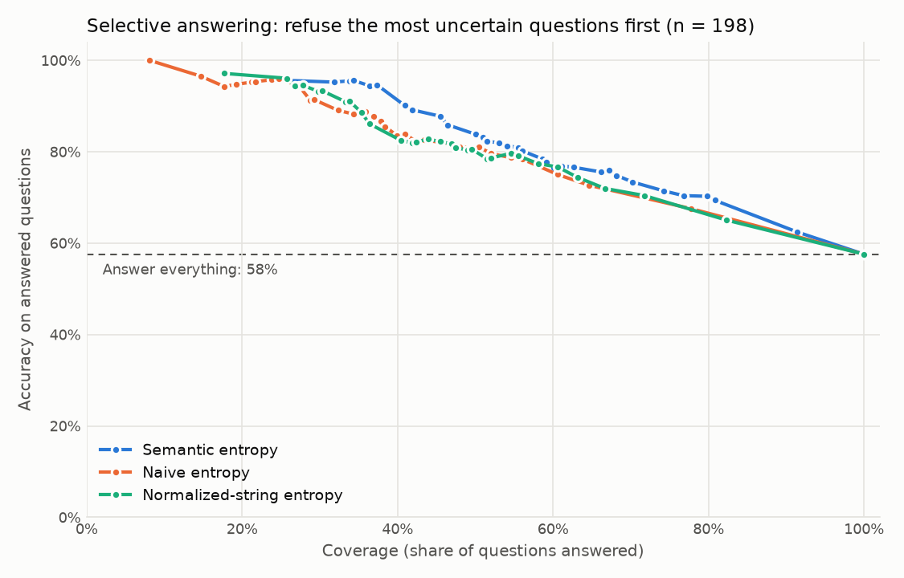

# Semantic Entropy Hallucination Detection

Detecting when a large language model (LLM) is likely hallucinating by sampling several answers to the same question and measuring how much they disagree **in meaning**.

## The problem

LLMs often produce fluent, confident answers that are factually wrong. One useful signal is the model's own uncertainty: if you ask the same question several times and get answers that mean different things, the model probably doesn't know the answer.

Measuring that uncertainty is not simple. Token-level metrics such as log-probability or naive entropy over output strings treat *"Paris"*, *"It's Paris."*, and *"The capital of France is Paris"* as three different answers, even though they mean the same thing. That inflates the apparent uncertainty and hides the signal we care about.

## Approach: semantic entropy

Semantic entropy (Kuhn, Gal & Farquhar, 2023; Farquhar et al., *Nature* 2024) measures uncertainty over **meanings** rather than strings:

1. **Sampling:** For a given question, sample *N* answers from the LLM at a non-zero temperature.
2. **Entailment clustering:** Group answers that mean the same thing. Two answers go in the same cluster if each entails the other (bidirectional entailment), as judged by an NLI model or an LLM.
3. **Entropy computation:** Estimate a probability for each meaning cluster (from sequence likelihoods, or from cluster sizes when likelihoods aren't available) and compute the entropy over clusters:

   $$SE(x) = -\sum_{c} p(c \mid x) \log p(c \mid x)$$

   Low entropy means the answers agree in meaning, so the model is probably confident. High entropy means the answers disagree in meaning, so the answer is likely a hallucination.
4. **Evaluation:** Check how well semantic entropy predicts incorrect answers on QA datasets with known ground truth (for example AUROC and accuracy–rejection curves), and compare it with baselines such as naive predictive entropy.

## Status

The full pipeline has been run on 200 questions:

- **Data:** 200 TriviaQA validation questions (`mandarjoshi/trivia_qa`, `rc.nocontext`), drawn as a reproducible shuffled slice with a fixed seed (0).
- **Tested model:** `openai/gpt-oss-20b` via Groq (`llama-3.1-8b-instant` wasn't available on this account). For each question it gives 10 sampled answers at temperature 1.0, plus one answer at temperature 0. The temperature-0 answer is the one that gets graded.
- **Clustering:** bidirectional entailment with the NLI model `microsoft/deberta-large-mnli`.
- **Scores:** semantic entropy, plus three baselines: naive entropy over the raw answer strings, normalized-string entropy (lowercased, punctuation and articles removed), and 1 − agreement rate.
- **Grading:** an LLM judge, `openai/gpt-oss-120b` (a larger model than the one being tested), labels each temperature-0 answer CORRECT, INCORRECT or NOT_ATTEMPTED. A normalized alias match against the gold answers is recorded alongside it.
- **Graded:** 198 of 200 questions. The other 2 were excluded as NOT_ATTEMPTED because the model gave no real answer ("A lap is a group of fish called a **lap** of fish." and "None.").

An earlier 25-question pilot reported in previous versions of this README is superseded by these results.

## Running it

1. **Set up your API key.** Copy the example env file and set `GROQ_API_KEY` in `.env`. `.env` is listed in `.gitignore`, so your key stays out of version control.

   ```bash
   cp .env.example .env
   ```

2. **Install the requirements** (Python 3.11):

   ```bash
   python3 -m venv .venv
   .venv/bin/pip install -r requirements.txt
   ```

3. **Run the pipeline** on a reproducible slice of TriviaQA validation questions. Each question is written to `results/metrics/pipeline_results.jsonl` as soon as it finishes, and finished questions are skipped on restart, so an interrupted run (for example by Groq's daily token limit) can simply be rerun. Failed questions are logged to `results/metrics/pipeline_failures.jsonl` and retried, up to 3 attempts. The first run downloads the NLI model (about 1.6 GB).

   ```bash
   .venv/bin/python -m src.evaluation.run_pipeline --n_questions 200 --seed 0
   ```

   To rerun only specific questions from the slice, add `--ids <id> <id> ...`.

4. **Analyze the results.** This prints the metrics and writes `summary.json`, `auroc.csv`, `auroc_differences.csv` and `selective_answering.csv` to `results/metrics/`, and the plot to `results/plots/`.

   ```bash
   .venv/bin/python -m src.evaluation.analyze
   ```

Run the unit tests with `.venv/bin/python -m unittest discover -s tests -t .`

To check whether replies are being cut off by the token limit, run `.venv/bin/python -m src.evaluation.probe_finish_reason` (optionally with `--ids`). It writes to `results/metrics/probe_finish_reason.jsonl`.

## Results

198 graded questions. The temperature-0 answer was correct on **57.6%** (114 of 198) according to the judge, and on 55.6% by alias match.

**AUROC for predicting an incorrect answer** (higher is better; 0.5 is chance), with 95% bootstrap confidence intervals (1,000 resamples of questions):

| Score | AUROC | 95% CI |
|---|---|---|
| Semantic entropy | 0.861 | [0.807, 0.910] |
| Naive entropy | 0.807 | [0.747, 0.864] |
| Normalized-string entropy | 0.810 | [0.751, 0.868] |
| 1 − agreement rate | 0.858 | [0.807, 0.907] |

**Paired differences** (semantic entropy minus each other score). Each bootstrap resample scores every method on the same questions, so noise that the scores share cancels out:

| Compared with | AUROC difference | 95% CI |
|---|---|---|
| Naive entropy | +0.055 | [+0.022, +0.087] |
| Normalized-string entropy | +0.051 | [+0.020, +0.079] |
| 1 − agreement rate | +0.003 | [-0.008, +0.015] |

What this shows:

- **All four scores beat chance** by a wide margin.
- **Semantic entropy beats both string-based entropies** by about 0.05 AUROC (+0.051 to +0.055), and both paired intervals exclude zero.
- **Semantic entropy ties with 1 − agreement rate.** The paired interval includes zero. Both scores are computed from the same clusters, so this is expected, and these results don't show semantic entropy beating agreement rate.

### Selective answering

If the system refuses to answer the questions it is least sure about, accuracy on the questions it does answer goes up. Coverage is the share of questions answered.



Accuracy when answering only the questions with semantic entropy at or below a threshold. Each row is a coverage level the threshold can actually reach, the closest one at or below 25%, 50%, 75% and 100%:

| Coverage | Questions answered | Semantic entropy threshold | Accuracy on answered questions | Accuracy answering everything |
|---|---|---|---|---|
| 23.7% | 47 of 198 | 0.000 | 95.7% | 57.6% |
| 50.0% | 99 of 198 | 1.089 | 83.8% | 57.6% |
| 74.2% | 147 of 198 | 1.834 | 71.4% | 57.6% |
| 100.0% | 198 of 198 | 2.303 | 57.6% | 57.6% |

**Coverage can't be set freely.** 47 of the 198 questions tie at semantic entropy 0 (all 10 samples in one cluster), so the smallest possible coverage short of refusing everything is 23.7%. Above that, coverage moves in steps wherever several questions share an entropy value. Entropy scores are rounded to 9 decimals before analysis, so values that differ only by floating-point noise count as ties.

### Where high entropy comes from on correct answers

By inspection of 10 examples (the 10 correct answers with the highest semantic entropy), 6 were mainly **clustering splits**, where answers meaning the same thing landed in different clusters, and 4 were **real disagreement**, where the samples gave genuinely different answers. None was mainly a wrong merge, but 2 contained one. The examples, with each question's samples, cluster ids and classification, are in [results/metrics/high_entropy_correct_review.md](results/metrics/high_entropy_correct_review.md).

## Limitations

1. **Clustering errors.** The NLI model often judges a short answer and a longer one with the same meaning as not entailing each other, because the longer answer adds detail. For "Which title character was named Dolores Haze?", the samples "Lolita." and "Dolores Haze is the title character in Nabokov's novel *Lolita*." ended up in different clusters. This inflates semantic entropy on questions the model answers correctly at varying lengths. The opposite error also happens with short answers: for "What is the 21st letter of the Greek alphabet?", "Φ" (Phi) and "Tau" were merged into one cluster.
2. **Narrow evaluation.** One dataset slice and one tested model. The bootstrap resamples questions only, so the confidence intervals don't include the randomness of sampling, clustering or judging.
3. **Discrete semantic entropy.** Groq's API doesn't return token probabilities, so each cluster's probability is estimated from how many of the 10 samples it contains.
4. **Token cut-off bug (fixed).** The temperature-0 answers for 2 questions originally came back empty. A probe ([results/metrics/probe_finish_reason.jsonl](results/metrics/probe_finish_reason.jsonl)) showed that they stopped at 2,048 completion tokens with `finish_reason="length"`: the model's hidden reasoning used up the limit before it wrote an answer. The pipeline now sets `max_completion_tokens=4096`, and treats cut-off or empty replies as failed calls. That 2,048-token limit is inferred to be Groq's default, since our code didn't set one; it isn't confirmed. Answers from before the fix have no recorded `finish_reason`, so they can't be checked directly for cut-offs. 0 of the 2,000 sampled answers are empty, and 7 short ones look suspicious ("Dr." ×5, "P." ×2). The 2 affected questions have been rerun and are now graded; both count as incorrect.
5. **Judge reliability.** The judge's labels were checked by eye on 15 randomly chosen examples, and they agree with alias matching on 94% of graded answers (186 of 198).
6. **Excluded questions.** Questions where the model gave no answer (NOT_ATTEMPTED) are excluded from the analysis.

## Project structure

```
.
├── data/                       # Reserved for datasets (TriviaQA is streamed from Hugging Face)
├── src/
│   ├── groq_chat.py            # Shared Groq client: rate-limit handling, token limit, finish_reason
│   ├── sampling/               # Sample answers from the tested model
│   ├── clustering/             # Bidirectional-entailment clustering of answers
│   ├── entropy/                # Semantic entropy and baseline scores
│   └── evaluation/
│       ├── data_loading.py     # Reproducible TriviaQA slice
│       ├── judge.py            # LLM judge and alias matching
│       ├── run_pipeline.py     # Sample, cluster, score and grade each question
│       ├── analyze.py          # Accuracy, AUROC, paired bootstrap, selective answering
│       └── probe_finish_reason.py  # Diagnostic probe for token-limit cut-offs
├── tests/                      # Unit tests for the entropy scores
├── results/
│   ├── metrics/                # Per-question results (JSONL), metric tables, probe output, example review
│   └── plots/                  # Selective-answering plot
├── requirements.txt
├── .env.example                # Template for required environment variables
└── README.md
```

## References

- Kuhn, L., Gal, Y., & Farquhar, S. (2023). *Semantic Uncertainty: Linguistic Invariances for Uncertainty Estimation in Natural Language Generation.* ICLR.
- Farquhar, S., Kossen, J., Kuhn, L., & Gal, Y. (2024). *Detecting hallucinations in large language models using semantic entropy.* Nature, 630, 625–630.
